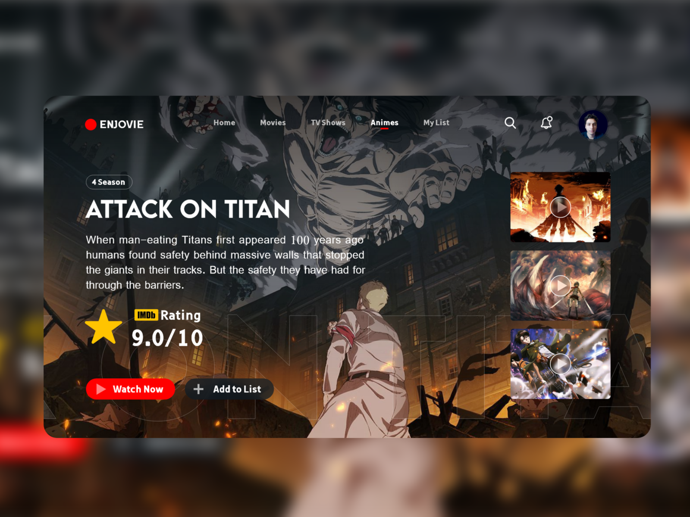

<h1 align="center">Project: Cineverse</h1>

<p align="center">
  
</p>

This project emulates the detailed display page of an audiovisual product within a streaming platform using modern web technologies to build an interactive and dynamic interface that is able to compete with the quality of the streaming platform market.

<p align="center">
  <a href="#-technologies">Technologies</a>&nbsp;&nbsp;&nbsp;|&nbsp;&nbsp;&nbsp;
  <a href="#-project">Project</a>&nbsp;&nbsp;&nbsp;|&nbsp;&nbsp;&nbsp;
  <a href="#-layout">Layout</a>&nbsp;&nbsp;&nbsp;|&nbsp;&nbsp;&nbsp;
  <a href="#-license">License</a>
</p>

## 🔗 Links
[](https://instagram.com/davidalmeidadev)
[](https://instagram.com/davidalmeidadev)
[](https://react-project-portfolio.vercel.app/)
[](./LICENSE)

## 🚀 Tecnologies

This project was developed with the following technologies:

- HTML5, CSS3, JS ES6+
- [Node e Yarn](https://nodejs.org/)
- [React.js](https://react.dev/)
- [React Icons](https://www.npmjs.com/package/react-icons)
- [Emotion](https://emotion.sh/docs/introduction)
- [Typescript](https://www.typescriptlang.org/docs/)
- [Axios](https://axios-http.com/ptbr/docs/intro)
- [Context API](https://www.freecodecamp.org/news/context-api-in-react/)

## 💻 Project

In this project I used React to bring to life a fluid and responsive interface using the resources provided by the @Emotion library (CSS-in-JS), working on the concept of modularization components were created, requests were made and handled with Axios to supply the context of the application within the Context API.

The code was treated with some linters and formatters to guarantee a cohesive and coherent code structure, thus reducing the chances of syntax errors occurring with Typescript and the automation process carried out with the help of Husky and Lint-staged.

## 🏡 Get started

Installing project dependencies

```sh
yarn install
```

Application initialization

```sh
yarn start
```

Application build

```sh
yarn build
```

## 🔖 Layout

You can view the project layout by clicking [here](https://dribbble.com/shots/16585818-Attack-On-Titan-Web-UI-Design/attachments/11611176?mode=media).

<p align="center">
  
</p>

## 📝 License

This project is under the [MIT license](./LICENSE).